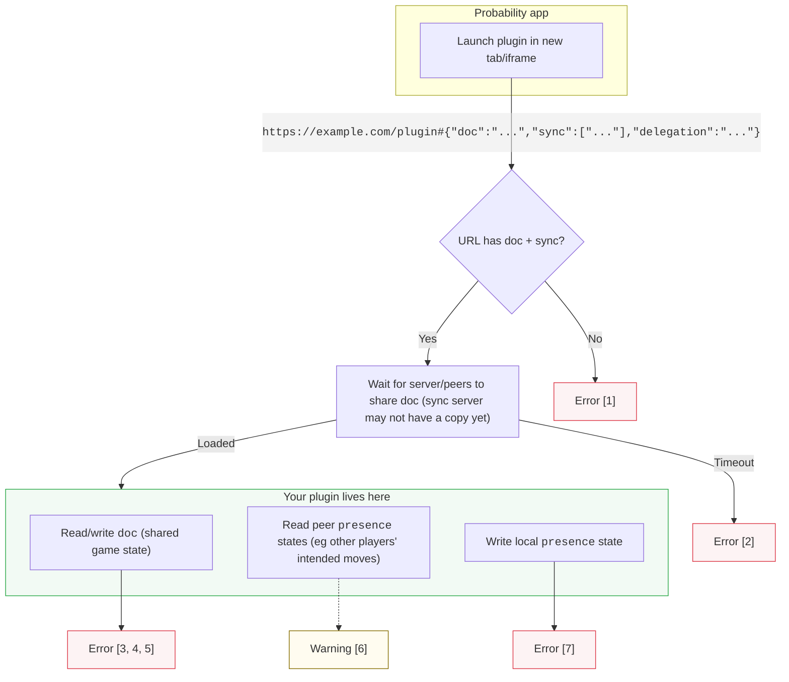

# @probability-nz/react

React SDK for building [Probability](https://probability.nz) plugins.

Plugins are web apps that can help with gameplay, act as an AI opponent, manage decks, enforce rules, etc.

They're launched with a special URL:

```jsonc
// https://example.com/plugin#{"doc":"...","sync":["..."],"delegation":"..."}
{
  "doc": "automerge:11111111111111111...", // Document URI (game ID)
  "sync": [ "wss://sync.probability.nz" ], // Servers to use
  "delegation": "L0r3mIp5umD0lorS1tAm3t==" // Permissions https://github.com/inkandswitch/keyhive
}
```

Once the app loads, `<ProbProvider>` connects to the sync server. `useProbDocument` handles the game state, and `usePresenceState` shows moves and changes.



### Errors:

1. **`parseHashProps()`**: invalid or missing URL hash
2. **Automerge sync**: doc never loads (60s timeout). [WebSocket errors are silent.](https://github.com/automerge/automerge-repo/issues/208)
3. **`changeDoc()`**: doc schema validation failed
4. **`useProbDocument`**: document deleted by peer
5. **Doc update**: invalid mutation (eg `undefined`, non-serializable values)
6. ~~**Peer presence**: peer presence schema validation failed (`console.warn` in dev)~~ TODO
7. **`update()`**: local presence schema validation failed
